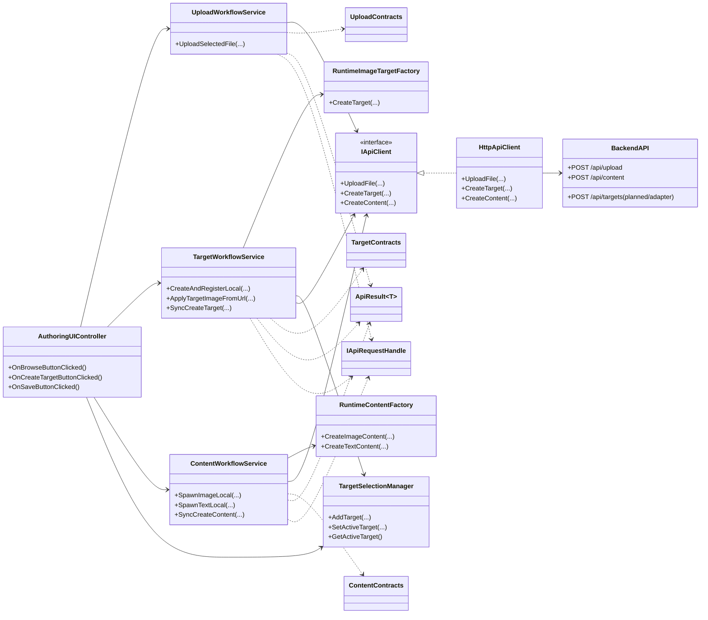
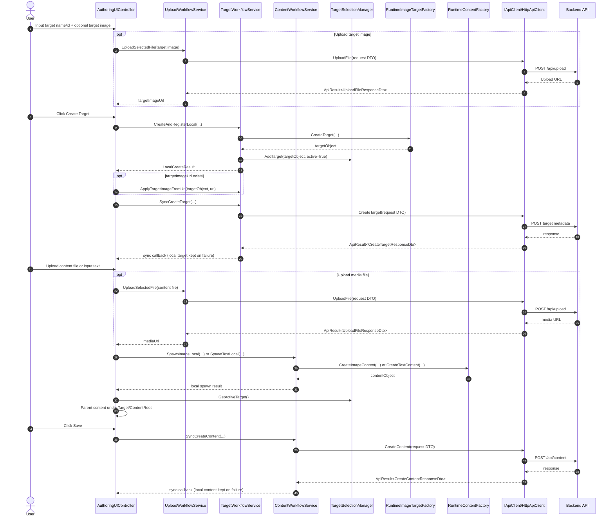

# Local-First Architecture and Workflow

This document describes:

1. Module integration for network/object/UI layers.
2. User-facing workflow and runtime/API data flow.

---

## Suggested Name and Placement

- **Name**: `ARCHITECTURE_LOCAL_FIRST_WORKFLOW.md`
- **Placement**: `Assets/Scripts/`

Rationale:
- This scope spans `Api`, `Target`, `Content`, and `AuthoringUIController`.
- Keeping it at `Assets/Scripts/` makes it discoverable for Unity frontend contributors.
- It stays close to implementation without being buried in a single module subfolder.

---

## 1) Modules Integration (UML)

---

## 2) User Workflow and Data Flow (UML)

