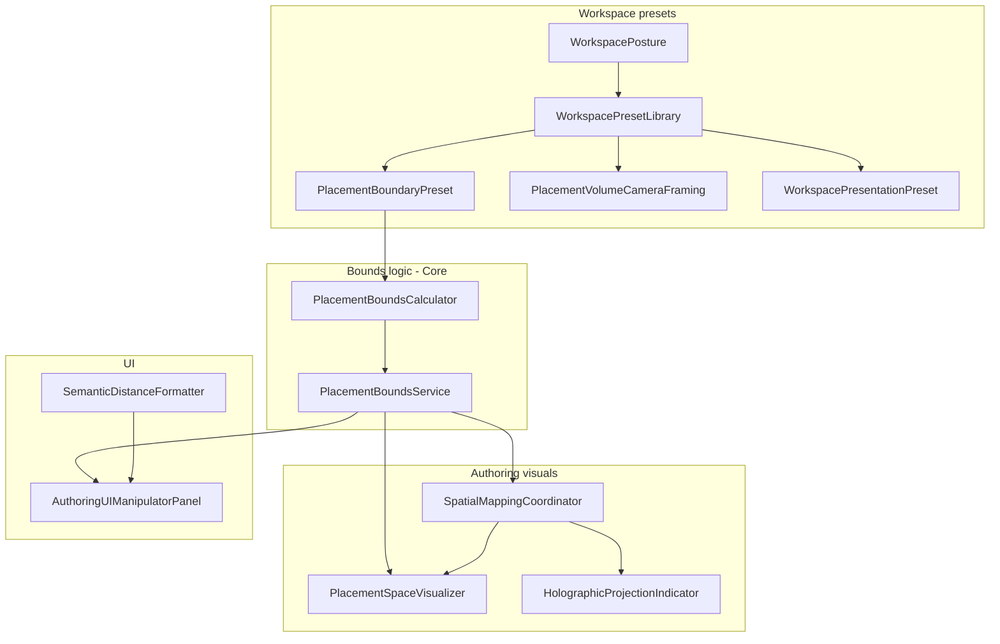

# Spatial Mapping System (Authoring Scene)

Authoring-only helpers that explain **where content may be placed** relative to the AR target, without changing runtime AR rendering or persisted transform semantics.

Related docs:

- [SemanticTransformInspectorAuthoring.md](SemanticTransformInspectorAuthoring.md) — semantic sliders and `ContentTransformManipulator`
- [WorkspacePresetSystem.md](WorkspacePresetSystem.md) — posture presets and scene entry
- [PlacementInteractionAndTransformAuthoring.md](PlacementInteractionAndTransformAuthoring.md) — interaction ownership

---

## Goals

- Show a **bounded editable region** (not an infinite empty scene)
- Communicate **left/right**, **up/down**, **closer/further** without raw transform numbers
- Keep all guides **target-relative** (ContentRoot-local, same as saved `localPosition`)
- Stay **lightweight** (line renderers, no room meshes, no physics)

---

## Architecture

---

## 1. Placement boundaries (posture-aware)

| File | Role |
|------|------|
| `Authoring/Core/PlacementBoundaryPreset.cs` | Per-posture XY scale, depth, margin, optional min standoff |
| `Authoring/Core/PlacementBoundsCalculator.cs` | Pure ContentRoot-local clamp ranges + box corners |
| `Authoring/Transform/PlacementBoundsService.cs` | Resolves bounds from `TargetVisual` + active preset |
| `Workspace/Presets/WorkspacePresetLibrary.cs` | Wall / Floor / Ceiling boundary table |

Content movement is still written only through `ContentTransformManipulator`; bounds are applied on every position change and slider range refresh.

---

## 2. Placement boundary visualization

| File | Role |
|------|------|
| `Authoring/SpatialMapping/PlacementSpaceVisualizer.cs` | Low-opacity red corner brackets at placement limits (no full box) |
| `Authoring/SpatialMapping/AuthoringLineVisualUtility.cs` | Shared transparent `LineRenderer` materials |

Parent: `{TargetRoot}/PlacementBoundaryVisual`. Does not use content meshes or colliders.

---

## 3. Spatial mapping indicators

| File | Role |
|------|------|
| `Authoring/SpatialMapping/HolographicProjectionIndicator.cs` | Subtle holographic frustum from target face to content (dashed edges + scan-line fill) |
| `Authoring/SpatialMapping/Shaders/AuthoringHologramProjection.shader` | URP hologram fill: scrolling stripe alpha mask, rim, scan lines (glitch off by default) |
| `Authoring/SpatialMapping/AuthoringHologramMaterialUtility.cs` | Runtime stripe mask + material setup |
Shown only when content is selected. Updates on:

- `AuthoringTransformCoordinator.ContentSelectionChanged`
- `ContentTransformManipulator.ContentTransformChanged`
- `LateUpdate` while selection is active

Parent: `{TargetRoot}/HolographicProjection`.

---

## 4. Real-world distance labels

| File | Role |
|------|------|
| `Authoring/Core/SemanticDistanceFormatter.cs` | e.g. `20 cm left`, `54 cm in front of target` |

Used by:

- Bottom manipulator value labels (`AuthoringUIManipulatorPanel`)
- Right inspector placement offset rows (`AuthoringUIController` + `AuthoringUI.uxml`)

Unity units are treated as **metres**. Raw `Local X/Y/Z` float fields were removed from the default content inspector.

---

## 5. Camera framing and presentation

| File | Role |
|------|------|
| `Workspace/Presets/PlacementVolumeCameraFraming.cs` | Camera pose from placement volume center/size |
| `Workspace/Presets/WorkspacePresetModels.cs` | `WorkspacePresentationPreset` (orientation helper, grid toggle) |

`AuthoringWorkspaceEntry.ApplyWorkspacePreset`:

1. Applies target rotation and placement boundary preset
2. Frames camera with `preset.camera` (look-at = volume center)
3. Applies optional `WorkspaceOrientationHelper` per posture
4. Refreshes `SpatialMappingCoordinator`

| Posture | Orientation helper | Typical camera |
|---------|-------------------|----------------|
| Wall | Off | Upper-rear, looks at volume center |
| Floor | On | Higher Y, downward tilt |
| Ceiling | On | Lower Y, upward tilt |

Inspector override: `AuthoringWorkspaceEntry.showOrientationHelper` can still force axes on for any posture.

---

## Scene wiring (`AuthoringToolScene`)

`AuthoringTransformSystems` GameObject:

- `PlacementBoundsService`
- `ContentTransformManipulator`
- `SpatialMappingCoordinator` (volume + indicators)
- Existing transform stack (`AuthoringTransformCoordinator`, gizmos, etc.)

---

## EditMode tests

| Test assembly | Covers |
|---------------|--------|
| `PlacementBoundsServiceTests.cs` | Calculator, presets, box corners |
| `SemanticDistanceFormatterTests.cs` | Label wording and units |
| `PlacementVolumeCameraFramingTests.cs` | Posture camera framing and presentation presets |

Run: Unity **Window → General → Test Runner → EditMode**.

---

## Manual acceptance checklist

1. Open `AuthoringToolScene` with a Wall workspace — cyan placement box visible around target.
2. Select content — holographic projection frustum from target to content; slider labels show cm/m phrases.
3. Switch Floor/Ceiling mock workspace — box depth/size and camera angle change; floor/ceiling show orientation axes.
4. Move content with bottom sliders — box unchanged, guides and labels update live.
5. Save/reload — `localPosition` in snapshot unchanged; guides reappear after reconstruct.

---

## Out of scope

- Runtime MobileViewer rendering changes
- Room reconstruction, physics colliders, multi-room navigation
- Changing `snapshot.json` schema (still stores raw local TRS)
