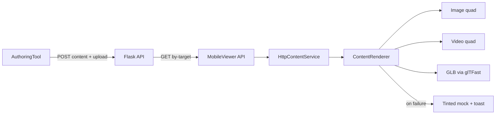

# Runtime Content Type Refinement

## Assignment : DEV-133 — Runtime content authoring and mobile rendering (image / video / model)

---

## Summary

DEV-133 closes the gap between **what authoring and the backend already support** and **what MobileViewer actually renders**. The canonical content types are:

| `contentType` | Authoring | Backend | MobileViewer (after DEV-133) |
|---------------|-----------|---------|------------------------------|
| `image` | Full | Full | Textured quad (unchanged) |
| `video` | Upload + local `VideoPlayer` | Persisted + mobile API | Quad + `VideoPlayer` (http URL, muted) |
| `model` | GLB via glTFast | Persisted + mobile API | Remote GLB via glTFast |

Related authoring work (one content slot per target, browse-to-replace) shares the same upload and save paths documented in [ObjectCreationWorkflow.md](ObjectCreationWorkflow.md) and [MultimediaObjectPoolAnd3DPrefabLoading.md](MultimediaObjectPoolAnd3DPrefabLoading.md).

---

## Outlines

### 1. End-to-end contract

- **Backend** accepts `contentType` ∈ `image` | `video` | `model` (lowercase). All three require `mediaUrl` on create/patch when type is media-backed.
- **Mobile API** `GET /api/mobileviewer/content/by-target/{targetKey}` returns `contentType`, `mediaUrl`, transforms, and target metadata. It does **not** expose `renderKind`; MobileViewer infers placement:
  - `image` and `video` → **surface** (same meter/offset rules as the image plane).
  - `model` → **volumetric** (raw `localPosition` / `localEuler` / `localScale` from API).
- **Authoring** maps file extensions to `SpawnContentType` and MIME on upload. Draft uploads pass **`contentId`** so the server stores a stable filename per content row.

See also: [`docs/api/mobileviewer/MobileViewerContentRuntime.md`](../../../../../docs/api/mobileviewer/MobileViewerContentRuntime.md).

### 2. Authoring — upload, MIME, and browse

**MIME guessing** is centralized in `UploadWorkflowService.GuessMimeTypeFromExtension` (also used from `AuthoringUIController` and `WorkspaceRemoteSyncService`):

| Extension | MIME |
|-----------|------|
| `.png` | `image/png` |
| `.jpg` / `.jpeg` | `image/jpeg` |
| `.mp4` | `video/mp4` |
| `.mov` | `video/quicktime` |
| `.webm` | `video/webm` |
| `.glb` | `model/gltf-binary` |
| `.gltf` | `model/gltf+json` |

**Browse filter** (content FAB / browse): `.png,.jpg,.jpeg,.glb,.mp4,.mov,.webm`

**Stable upload filenames**

- When `contentId` is provided on `UploadFileRequestDto`, the backend names the stored file `{contentId}{ext}` (see `upload_service._disk_filename_for_content_asset`).
- `UploadDraftMediaRoutine` calls `EnsureStableServerContentIdForDraft` then passes `ServerContentId` into `UploadSelectedFile` so re-uploads overwrite the same asset.

**Content replacement** (one slot per target) — see `ContentReplacementService` + `ReplaceActiveTargetContent` in `AuthoringUIController`: browse replaces in place, reuses `ServerContentId`, conditional transform inherit (surface↔surface or volumetric↔volumetric).

### 3. MobileViewer — rendering

| Type | Implementation | Notes |
|------|----------------|-------|
| Image | `ContentRenderer.RenderImageObject` | Unchanged behavior; shared `TryApplySurfaceTransform` |
| Video | `ContentRenderer.RenderVideoObject` | Procedural quad, `VideoPlayer` URL mode, **muted**, looped; YouTube URLs rejected |
| Model | `ContentRenderer.RenderModelObject` + `MobileGlbLoadService` | glTFast 6.18.0 (OpenUPM); download + `InstantiateMainSceneAsync` under `RuntimeModelRoot` |

Package: `MobileViewer/Packages/manifest.json` — `com.atteneder.gltfast` + scoped registry (matches AuthoringTool version).

### 4. MobileViewer — failure and fallback

Failures use `ContentRenderFailureReason` + `RenderFailureFallback`:

- Structured **log** with target, type, URL, and reason.
- **Toast** via serialized `MobileViewerStatusUI` (`ShowContentRenderFailed`).
- **Tinted mock primitive** (orange = media failure, gray = unsupported type).
- Legacy demo types (`cube`, `sphere`, `capsule` in `contentType`) still use normal `mockColor` (no failure tint).

Network/API errors on fetch remain in `TargetContentCoordinator`; render/media errors are owned by `ContentRenderer`.

### 5. Backend verification

Integration tests (`RUN_BACKEND_INTEGRATION=1`):

- Parametrized `test_target_content_mobileviewer_round_trip` for `image`, `video`, and `model` in `backend/test_integration.py`.

Unit smoke tests in `backend/test_app.py`:

- POST content for `video` and `model` (201).
- Empty `mediaUrl` rejected for video/model.
- Invalid `contentType` (e.g. `text`) rejected.

---

## Modification

Paths below are repo-relative unless noted.

### 1. AuthoringTool — `Assets/Scripts/`

| File | Description |
|------|-------------|
| **Api/Services/UploadWorkflowService.cs** | MIME map (incl. `.mov`, `.webm`, `.glb`); optional `contentId` on upload; extension-aware default filenames; `uploadCategory = content`. |
| **AuthoringUIController.cs** | Browse filter includes `.webm`; draft upload passes `contentId`; `GuessMimeTypeFromExtension` delegates to upload service. |
| **Workspace/Persistence/WorkspaceRemoteSyncService.cs** | `GuessMimeTypeFromName` uses shared MIME helper. |
| **Content/Services/ContentReplacementService.cs** | One content per target; pool release; transform/identity rules on replace (DEV-133 authoring companion). |

### 2. MobileViewer — `Assets/Scripts/`

| File | Description |
|------|-------------|
| **Content/ContentRenderer.cs** | Video and model branches; surface/volumetric placement; failure fallback; `Hide()` cleanup for all media types. |
| **Content/MobileGlbLoadService.cs** | Remote GLB download + glTFast import. |
| **Content/ContentRenderFailure.cs** | Failure enum + toast/panel message helpers. |
| **UI/MobileViewerStatusUI.cs** | `ShowContentRenderFailed` for danger toasts. |
| **AR/TargetContentCoordinator.cs** | Unchanged API fetch; render failures handled in `ContentRenderer`. |

### 3. MobileViewer — packages and scene

| Path | Description |
|------|-------------|
| **Packages/manifest.json** | `com.atteneder.gltfast` 6.18.0 + OpenUPM scoped registry. |
| **Scenes/MobileViewerScene.unity** | `ContentRenderer.statusUI` wired to `MobileViewerStatusUI` on `MobileViewerRuntime`. |

### 4. Backend — `backend/`

| File | Description |
|------|-------------|
| **test_integration.py** | Video/model mobileviewer round-trip tests (with image regression). |
| **test_app.py** | Video/model create validation smoke tests. |

### 5. Documentation (cross-project)

| File | Description |
|------|-------------|
| **docs/api/mobileviewer/MobileViewerContentRuntime.md** | Runtime behavior for image/video/model and failure notes. |
| **MobileViewer/Assets/Scripts/docs/App/MobileViewerBackendDemoNetworking.md** | Demo flow updated for full render paths. |

---

## Data flow (authoring → mobile)

---

## Manual verification checklist (DEV-133)

Run with backend up and content saved from AuthoringTool (manual Save).

1. **Image regression** — Existing JPG/PNG target; plane size/position unchanged vs pre-DEV-133.
2. **Video** — Browse MP4 → Save → scan target on device; muted video on surface quad. Optional: MOV on iOS.
3. **Model** — Browse `.glb` → Save → scan; model at authored volumetric transform.
4. **Authoring MIME** — `.webm` appears in browse; re-save does not multiply upload files when `ServerContentId` is stable.
5. **Failures** — Invalid `mediaUrl` or YouTube URL as video → tinted mock + toast; app does not crash.
6. **Backend tests** — `cd backend && .venv/bin/python -m pytest test_app.py -q` and `RUN_BACKEND_INTEGRATION=1 .venv/bin/python -m pytest test_integration.py -v`.

---

## Explicitly out of scope (DEV-133)

- YouTube playback in mobile runtime (URLs may be stored in authoring; mobile rejects with fallback).
- Adaptive streaming, resolution ladders, or WebM guarantees on all platforms (WebM: attempt play, graceful fallback).
- `renderKind` on mobile API payload.
- Multi-content-per-target, persistent AR anchors, full scene composition.
- `.gltf` sidecar loading (GLB only on mobile).

---

## Related assignments

| Ticket | Topic | Doc |
|--------|--------|-----|
| DEV-94 | API client workflow | [ObjectCreationWorkflow.md](ObjectCreationWorkflow.md) |
| DEV-95 | Pool + 3D prefab / GLB in authoring | [MultimediaObjectPoolAnd3DPrefabLoading.md](MultimediaObjectPoolAnd3DPrefabLoading.md) |
| — | Target transforms | [TargetCentricTransformAuthoring.md](TargetCentricTransformAuthoring.md) |
